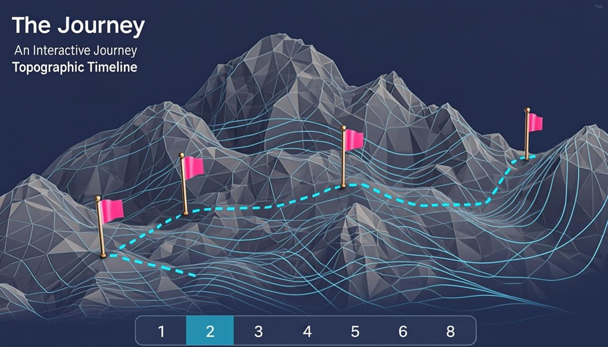
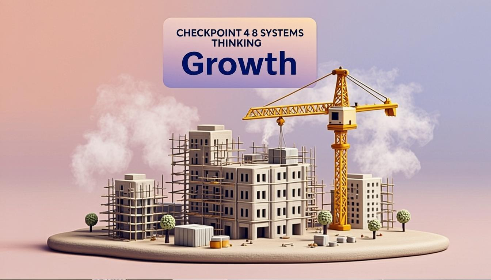
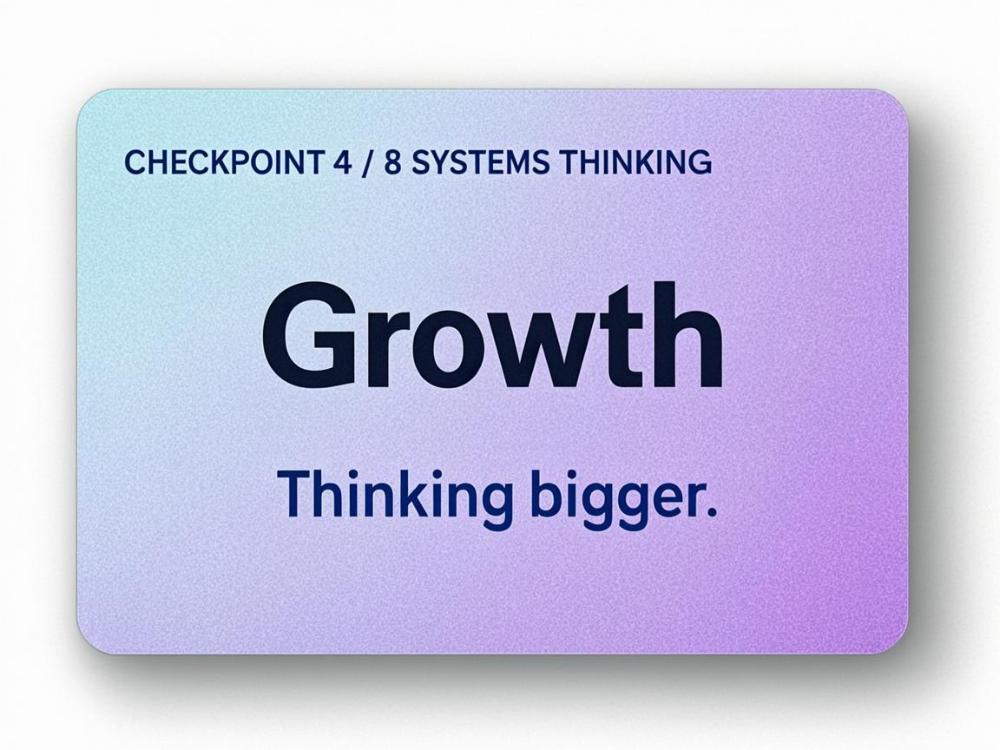

# The Journey

> An interactive 3D topographic timeline where each peak and valley marks a stage of personal growth. Follow the dashed trail across 8 checkpoints on a pastel Gaussian heightfield — each one opens a handcrafted clay-style diorama.


---

## Snapshots

### 1. Topographic Terrain Overview

The main view — a 3D Gaussian heightfield with 22 cyan contour lines, 8 checkpoint flags (gold finials, pink striped flags), and a 4px dashed trail connecting them. Auto-rotates after 4 seconds of inactivity.



### 2. Checkpoint Diorama Scene

Clicking a checkpoint flies the camera there, then auto-opens a near-fullscreen scene panel. Each checkpoint has a unique handcrafted clay-style diorama (this is checkpoint 4 — "Growth", a construction site with a swinging crane). The studio cyclorama background provides a seamless peach-to-blue gradient with atmospheric fog.



### 3. Sign Card Detail

The paper-like sign card at the top of each scene — a periwinkle-to-lavender diagonal gradient with navy serif text (Playfair Display). The label is perfectly centered with equal left/right margins, the title renders at black weight (900), and the subtitle sits below in semibold italic.



---

## Table of Contents

- [Overview](#overview)
- [Features](#features)
- [Technology Stack](#technology-stack)
- [Quick Start](#quick-start)
- [Usage](#usage)
- [Keyboard Shortcuts](#keyboard-shortcuts)
- [Project Structure](#project-structure)
- [The 8 Checkpoints](#the-8-checkpoints)
- [Development](#development)
- [Deployment](#deployment)
- [Documentation](#documentation)
- [Roadmap](#roadmap)
- [License](#license)

---

## Overview

**The Journey** is an interactive 3D web experience built with Next.js, React Three Fiber, and Three.js. Users explore a pastel-colored topographic terrain representing a personal growth narrative across 8 stages — from Genesis (curiosity) to Present (endless curiosity).

Each checkpoint is a flag on the terrain. Clicking it triggers an eased camera fly-to animation, then auto-opens a scene panel with:
- A handcrafted clay-style 3D diorama symbolizing that stage
- A sign card with the checkpoint title, theme, and subtitle
- The full reflective description text
- A timeline showing progress through all 8 checkpoints

A standalone vanilla Three.js mirror (`download/index.html`) is maintained in parallel for static hosting (GitHub Pages).

---

## Features

### Terrain
- **3D Gaussian heightfield** — 4 peaks, 1 saddle, 7 small hills, FBM noise, edge fade
- **Baked shading** — hillshade, slope darkening, valley ambient occlusion, procedural texture (all pre-computed into vertex colors, zero per-frame GPU cost)
- **22 marching-squares contour lines** in cyan with major/minor hierarchy
- **4px thick dashed trail** connecting all checkpoints (Line2 screen-space shader)

### Checkpoints
- **8 flags** with gold finials, pink striped flags, canvas-texture number sprites, animated beacon lights
- **Eased camera fly-to** with 3-tier elevation-aware positioning
- **Auto-open scene panel** when the camera arrives

### Dioramas
- **8 themed clay-style dioramas** — Genesis workshop, Discovery overlook, Challenge fractured path, Growth construction site, Apex summit, Transition misty fork, Reinvention convergence garden, Present campsite
- **24 reusable building blocks** (Tree, Bush, Rock, Gear, Cloud, Bird, Flag, Lantern, Crane, Campfire, Telescope, etc.)
- **Studio cyclorama background** — half-cylinder vertex-color gradient (darkened peach horizon → atmospheric blue top)
- **Atmospheric fog** — darkened muted peach (#8a7560) for eye comfort, seamlessly blending with cyclorama horizon
- **Volumetric mist planes** — 4 transparent circles slowly rotating
- **Auto-orbiting camera** per diorama with per-checkpoint focus, radius, and height

### UI
- **Periwinkle→lavender sign card** — paper-like gradient card with navy serif text (Playfair Display 700/900/600)
- **8-stop gradual bottom shadow** — 60vh gradient, no hard split, 3D model visible up top
- **Dark unvisited checkpoints** — clear visual progression (dark → colored → active)
- **Full keyboard navigation** — 1-8, arrows, WASD, Space/↑ to open, ↓ to close, Esc, ?
- **Help popup** with ? button showing all shortcuts

---

## Technology Stack

| Technology | Version | Purpose |
|---|---|---|
| [Next.js](https://nextjs.org/) | 16.1.3 | App router, SSR, Turbopack bundler |
| [React Three Fiber](https://r3f.docs.pmnd.rs/) | 9.x | Declarative Three.js in React |
| [Three.js](https://threejs.org/) | 0.184.0 | 3D rendering, Line2, PCFSoftShadowMap |
| [@react-three/drei](https://github.com/pmndrs/drei) | 10.x | OrbitControls, helper components |
| [Tailwind CSS](https://tailwindcss.com/) | 4.x | Utility-first styling for UI overlays |
| [Playfair Display](https://fonts.google.com/specimen/Playfair+Display) | 400-900 | Serif typography for sign card |
| [TypeScript](https://www.typescriptlang.org/) | 5.x | Type safety for Next.js source |

---

## Quick Start

### Prerequisites

- **Node.js** 18+ and npm
- A modern browser with WebGL support

### Option A: Next.js Dev Server (recommended for development)

```bash
# Clone the repository
git clone <repo-url>
cd my-project

# Install dependencies
npm install

# Start the dev server
npm run dev
```

Open [http://localhost:3000](http://localhost:3000) in your browser.

### Option B: Standalone HTML (no build required)

The standalone version requires no installation — just open the file:

```bash
# On macOS
open download/index.html

# On Linux
xdg-open download/index.html

# Or serve it locally
python3 -m http.server 8000 --directory download
# Then open http://localhost:8000
```

---

## Usage

1. **The terrain loads** with auto-rotate enabled after 4 seconds of inactivity
2. **Click any checkpoint flag** (or press 1-8) to fly the camera there
3. **The scene panel auto-opens** on arrival, showing the diorama and text
4. **Read the description** at the bottom of the panel
5. **Press Esc or ↓** to close the panel and orbit the checkpoint freely
6. **Press Esc again** to return to the intro overview
7. **Use the timeline** at the bottom to jump between checkpoints
8. **Press ?** anytime to see all keyboard shortcuts

---

## Keyboard Shortcuts

| Key | Action |
|-----|--------|
| `1`–`8` | Fly to checkpoint N |
| `←` / `A` | Previous checkpoint |
| `→` / `D` | Next checkpoint |
| `Space` / `↑` / `W` | Open scene panel |
| `↓` / `S` | Close scene panel |
| `Esc` | Close panel, or reset to intro view |
| `?` | Toggle help popup |
| `Drag` | Orbit camera |
| `Scroll` | Zoom in/out |

---

## Project Structure

```
my-project/
├── documents/                  # Documentation (11 files)
│   ├── agent.md               # AI onboarding (read first)
│   ├── memory.md              # Current working state
│   ├── architecture.md        # System design
│   ├── decisions.md           # Engineering decisions log
│   ├── conventions.md         # Coding standards
│   ├── workflows.md           # Build/test/deploy workflows
│   ├── api.md                 # Public interfaces
│   ├── roadmap.md             # Development roadmap
│   ├── testing.md             # Test checklists
│   ├── glossary.md            # Terminology
│   └── prompts.md             # Reusable AI prompts
│
├── screenshots/                # Preview images for README
│
├── src/
│   ├── app/
│   │   ├── page.tsx           # Main UI, state, keyboard, scene panel (275 lines)
│   │   ├── layout.tsx         # Root layout, fonts (Playfair 400-900)
│   │   └── globals.css        # Global styles
│   └── components/
│       └── three/
│           ├── terrain-utils.ts        # Heightfield, checkpoints, colors (140 lines)
│           ├── TopographicTerrain.tsx  # Terrain mesh, contours, trail, flags (449 lines)
│           ├── CheckpointDiorama.tsx   # 24 building blocks + 8 dioramas (1599 lines)
│           └── SceneMediaViewer.tsx    # Cyclorama, fog, camera config (178 lines)
│
├── download/
│   └── index.html             # Standalone vanilla Three.js mirror (2186 lines)
│
├── public/                    # Static assets (logo, robots.txt)
├── worklog.md                 # Multi-agent work log
└── package.json
```

---

## The 8 Checkpoints

| # | Title | Theme | Diorama |
|---|-------|-------|---------|
| 1 | **Genesis** | Curiosity | Workshop with rotating gears, scattered blueprints, half-assembled inventions |
| 2 | **Discovery** | Learning through leverage | Overlook with telescope, stacked books, 5 glowing nodes linked by lines |
| 3 | **Challenge** | Reframing | Fractured path, two broken bridges, small maze, signpost, glowing lantern |
| 4 | **Growth** | Systems Thinking | Construction site with 4 buildings, swinging crane, scaffolding, bridges |
| 5 | **Apex** | Beyond Achievement | Summit with observation platform, bench, flag, 4 distant mountain peaks |
| 6 | **Transition** | Reflection | Misty fork with central clearing, 3 trail rings, 2 signposts, 4 mist patches |
| 7 | **Reinvention** | Convergence | Garden with glowing tree, miniature echoes of earlier checkpoints, flowers |
| 8 | **Present** | Endless Curiosity | Winding trail to camp with tent, campfire, small observatory |

---

## Development

### Build Commands

```bash
# Development server with hot reload
npm run dev

# Production build
npm run build

# Start production server
npm run start

# Typecheck (excludes scaffold files)
npx tsc --noEmit --skipLibCheck

# Lint
npm run lint
```

### Development Workflow

1. Make changes in `src/` (Next.js)
2. Typecheck: `npx tsc --noEmit --skipLibCheck`
3. Test in dev server: `npm run dev`
4. Mirror changes in `download/index.html` (standalone)
5. Validate standalone JS syntax
6. Run manual test checklist (see `documents/testing.md`)
7. Update `documents/memory.md` with completed work
8. Commit with conventional message (`feat:`, `fix:`, `docs:`, etc.)

### Git Checkpoints

Saved stable versions you can return to:

```bash
git tag                          # List all checkpoints
git checkout descriptions-complete  # Latest stable state
```

| Tag | Description |
|-----|-------------|
| `descriptions-complete` | All 8 descriptions finalized + full visual state |
| `description-finished` | All 8 descriptions done (earlier) |
| `decent-images-restored` | Visual state restored after environment reset |
| `v4.0-stable` | Early stable version |

---

## Deployment

### GitHub Pages (Standalone)

The standalone HTML file is self-contained (Three.js loaded from CDN) and can be deployed to any static host:

```bash
# Copy to a GitHub Pages repo
cp download/index.html /path/to/gh-pages-repo/index.html
cd /path/to/gh-pages-repo
git add index.html
git commit -m "deploy: update standalone"
git push
```

### Vercel / Netlify (Next.js)

```bash
npm run build
# Deploy via platform CLI or git integration
```

---

## Documentation

Full documentation lives in `documents/`. Start with:

1. **[`agent.md`](documents/agent.md)** — Primary onboarding document (read first)
2. **[`memory.md`](documents/memory.md)** — Current working state and TODOs
3. **[`architecture.md`](documents/architecture.md)** — System design and data flow
4. **[`decisions.md`](documents/decisions.md)** — Why things were done this way

See [`documents/agent.md`](documents/agent.md) for the complete documentation map and reading order.

---

## Roadmap

### Completed
- [x] 3D terrain with baked shading
- [x] 8 themed clay dioramas
- [x] Studio cyclorama + atmospheric fog
- [x] Periwinkle→lavender sign card
- [x] All 8 checkpoint descriptions finalized
- [x] Full keyboard navigation + help popup
- [x] Standalone HTML mirror

### In Progress
- [ ] Sync standalone HTML diorama content with Next.js themed dioramas
- [ ] Production build verification
- [ ] GitHub Pages deployment

### Planned
- [ ] Split `CheckpointDiorama.tsx` into per-diorama files
- [ ] Mobile touch controls for standalone
- [ ] localStorage persistence for visited checkpoints
- [ ] Ambient sound effects
- [ ] Real GLB models replacing procedural geometry

See [`documents/roadmap.md`](documents/roadmap.md) for the full roadmap.

---

## License

This project is licensed under the MIT License — see the [LICENSE](LICENSE) file for details.

---

## Acknowledgments

- Built with [Next.js](https://nextjs.org/), [React Three Fiber](https://r3f.docs.pmnd.rs/), and [Three.js](https://threejs.org/)
- Typography: [Playfair Display](https://fonts.google.com/specimen/Playfair+Display) by Claus Eggers Sørensen
- Terrain rendering inspired by topographic map aesthetics
- Clay diorama style inspired by stop-motion animation and miniature photography
